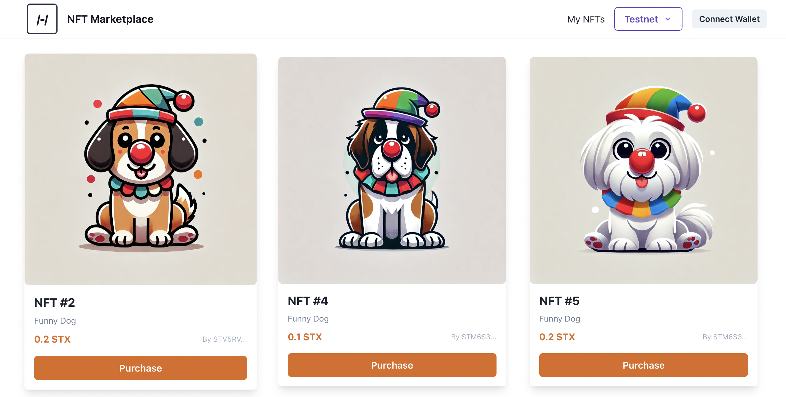

nft trait contract address = ST3YD3FDPWRKJ3BZ2BFA1YFKKZ8W87V79QE43EHG4.nft-trait
nftmarketplace  address =taking too much gas


This is a full-stack demo of an NFT marketplace built on the Stacks blockchain, allowing users to mint, list, and purchase NFTs using STX tokens. This project demonstrates how to build decentralized Stacks applications using Clarity smart contracts and Next.js with the Hiro Platform.

By following this guide, you can have a working NFT marketplace live on the Stacks blockchain in less than 5 minutes!

(This example app is intended for educational purposes only. The provided smart contracts have not been audited.)

## Features

- Mint NFTs to user wallets
- List NFTs for sale
- Secure ownership tracking and transfers
- Pre-configured STX wallet plugin for Devnet testing

## Getting Started

### Prerequisites

- [Hiro Platform](https://platform.hiro.so) account
- Node.js 18+ and npm/yarn/pnpm
- _(Recommended)_ [Clarinet](https://github.com/hirosystems/clarinet) and the [Clarity VSCode Extension](https://marketplace.visualstudio.com/items?itemName=HiroSystems.clarity-lsp)

### Setup Development Environment

1. **Start Devnet in Hiro Platform**

   - Log into the [Hiro Platform](https://platform.hiro.so)
   - Navigate to your project and start Devnet
   - Copy your API key from either:
     - The Devnet Stacks API URL: `https://api.platform.hiro.so/v1/ext/<YOUR-API-KEY>/stacks-blockchain-api`
     - Or from https://platform.hiro.so/settings/api-keys

2. **Configure Local Environment**

   Git clone the project code to your local machine via HTTPS or SSH and navigate to the project root in your terminal.

   ```bash
   # Install Clarity project dependencies
   cd clarity
   npm install

   # Configure frontend environment
   cd ../front-end
   npm install
   cp .env.example .env
   ```

   Add your Hiro Platform API key to the renamed `.env` file:

   ```
   NEXT_PUBLIC_PLATFORM_HIRO_API_KEY=your-api-key-here
   ```

3. **Start the Frontend Application**

   Start the Next.js application from the front-end directory.

   ```bash
   npm run dev
   ```

   Visit [http://localhost:3000](http://localhost:3000) to view and interact with the marketplace. If Devnet is running, your test wallets will already be funded and connected for testing.

## Testing with Devnet

The Hiro Platform's Devnet is a sandboxed, personal blockchain environment for testing your dApps before deploying them to the testnet or mainnet. Each time you start a new Devnet, it will reset the blockchain state and deploy your project contracts from scratch.

This is useful because deployments to the blockchain are permanent and cannot be undone. Ensure you have tested your contracts thoroughly in the Devnet before promoting them to the testnet or mainnet!

### 1. Start Devnet and Deploy Contracts

1. Open your project in the Hiro Platform
2. Click "Start Devnet" to initialize your testing environment (the contracts will be automatically deployed per your deployment plan)
3. You should see your contracts deployed and the initial NFT mints occur no later than block 45 in the Devnet dashboard

### 2. Testing Smart Contract Functions

Smart contract functions can be tested directly from your Platform dashboard.

1. Select the Devnet tab to confirm that your contracts are deployed and Devnet is running
2. Click "Interact with Devnet" and then "Call functions"
3. Select your contract and the function you want to test from the dropdown menus
4. Use one of the pre-funded devnet wallets as the caller and another as the recipient (if needed)
5. Click "Call function" to execute the function, which will either succeed or fail based on the function's logic and the caller's permissions
6. Once the function has been submitted, you can watch for the transaction to resolve on-chain in the Devnet dashboard and confirm that the function executed as expected

Remember that any changes to the contracts will require restarting Devnet and redeploying the contracts!

### 3. NFT Marketplace Integration Testing

With Devnet running, you can test your front-end functionality and validate that it's working in the same way you just tested the NFT contract functions.

1. Confirm that your Devnet is running in the Platform dashboard and `npm run dev` is running in the front-end directory
2. Navigate to [http://localhost:3000](http://localhost:3000) to view and interact with the marketplace
3. View your NFTs in the marketplace and test the minting, listing, and purchasing functionality using the pre-funded wallets.
4. Navigate to the Devnet dashboard in the Platform to view the transactions as they are submitted and resolved on-chain.

You do not need to restart Devnet to test changes to your front-end.

## Next Steps

Once you've thoroughly tested your dApp in Devnet and are confident in its functionality, you can proceed to testing on the Stacks Testnet before launching on Mainnet.

### Moving to Testnet

1. Use the [Stacks Testnet Faucet](https://explorer.hiro.so/sandbox/faucet?chain=testnet) to get test STX tokens
2. Deploy your contracts to the Testnet using the Platform dashboard and your same deployment plan
3. Test your application with real network conditions and transaction times
4. Verify your contract interactions in the [Testnet Explorer](https://explorer.hiro.so/?chain=testnet)

### Launching on Mainnet

When you're ready to launch your NFT marketplace officially:

1. Ensure you have real STX tokens for deployment and transaction costs
2. Update your deployment configuration to target Mainnet
3. Deploy your contracts through the Platform dashboard
4. Update your frontend environment variables to point to Mainnet
5. Launch your application and begin processing real transactions!

Remember: Mainnet deployments are permanent and involve real cryptocurrency transactions. Double-check all contract code and frontend integrations before deploying to Mainnet.
